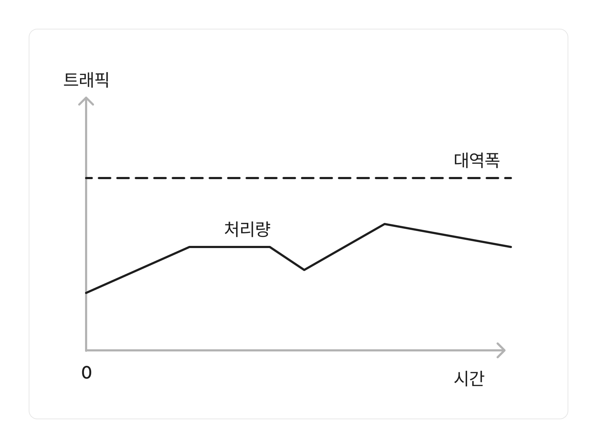
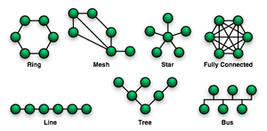
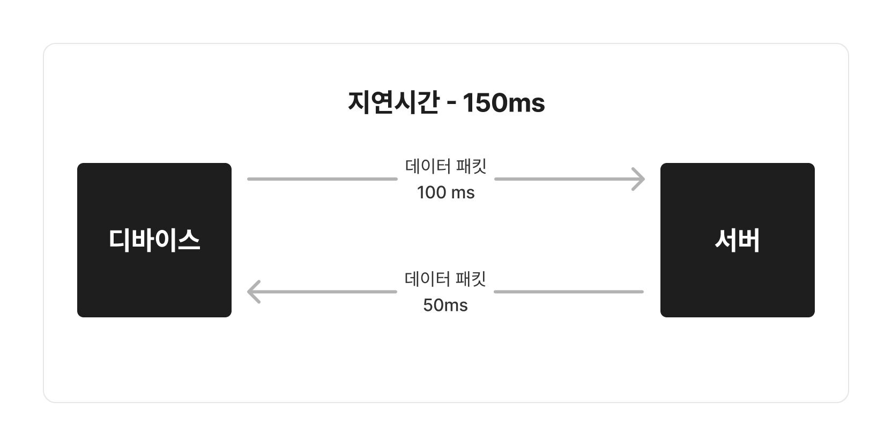

# 1. 네트워크의 기초

 

네트워크라는 것은 노드(node)와 링크(link)가 서로 연결되어 리소스를 공유하는 집합을 의미한다.

**노드(node)**

-   서버, 라우터, 스위치 등의 네트워크 장치

**링크(link)**

-   유선, 무선

 

# 2. 처리량과 지연시간

처리량과 지연시간은 컴퓨터 네트워트의 성능을 측정하는 두 가지 지표이다.

처리량에 따라 네트워크에 접근할 수 있는 사용자의 수가 결정되고, 지연 시간에 따라 사용자가 네트워크에서 데이터를 주고받을 때 걸리는 시간을 알 수 있다.

처리량이 적고 지연시간이 긴 네트워크는 많은 데이터를 전송하는데 어려움을 겪으며 정체(대기)가 발생하고 앱 성능이 저하된다.

반면 처리량이 많고 지연시간이 짧은 네트워크는 반응성이 좋고 효율적이다.

게임을 접속하거나 수강신청을 할 때 사람이 몰려 대기시간이 있는 경험을 했다면 이게 얼마나 중요한 것인지 알 수 있을것이다.

 

## 2-1. 처리량

특정 시간 동안 실제로 네트워크를 통과할 수 있는 평균 `데이터 양`을 가리킨다.

목적지에 성공적으로 도착한 데이터 패킷(데이터 조각)의 수와 데이터 패킷 손실을 나타낸다. 링크내에서 성공적으로 전달된 데이터의 양을 말하며, 얼만큼의 트래픽을 처리했는지를 나타낸다.

#### **측정방법**

네트워크 테스트 도구를 이용하거나 수동으로 측정한다.

파일을 전송하고 도착하는 데 걸리는 시간으로 파일의 크기를 나누면 수동으로 측정이 가능하다.

#### **단위**

단위로는 bps(bits per second)를 사용했으나, 현재는 기술의 발전으로 KBps, MBps, GBps 등의 단위로 처리량을 측정한다.

`파일의 크기(bit) / 전송시간(s)`

지연 시간과 대역폭이 처리량에 영향을 미치므로 다른 요인과 함께 보고하는 네트워크 테스트 도구를 이용한다.

    대역폭 - 주어진 시간 동안 네트워크 연결을 통해 흐를 수 있는 최대 비트수

#### **영향을 미치는 요인**

-   대역폭
    -   네트워크 용량이 전송 매체의 최대 대역폭에 도달시 처리량이 해당 제한을 초과할 수 없음
-   처리 능력(하드웨어 스펙)
    -   하드웨어의 성능에 따라서 처리량이 향상될 수 있음
-   패킷 손실
    -   네트워크 에러나 장치의 결함에 따라서 패킷이 손실되어 재전송 하는 경우, 지연 시간으로 인한 처리량 감소
-   네트워크 토폴로지
    -   네트워크 디바이스의 수, 네트워크 링크의 대역폭, 네트워크 경로의 디바이스 간 거리를 나타내며, 잘 설계된 네트워크 토폴로지는 트래픽 병목을 줄여 처리량을 증가시킨다.

 

## 2-2. 지연시간

지연 시간(latency)은 요청이 처리되는 `시간`을 말한다. 어떤 메시지가 두 장치 사이를 왕복하는데 걸린 `시간`을 의미한다.

#### **측정방법**

핑 시간을 측정하여 네트워크 지연 시간을 측정한다.

작은 데이터 패킷을 전송하고 해당 패킷이 도착했다는 확인을 받는다.

대부분의 OS에서는 ping 명령을 지원한다.

#### **단위**

단위로는 밀리초(ms)를 사용한다. 숫자가 클수록 성능이 낮음을 의미한다.

#### **영향을 미치는 요인**

-   위치
    -   물리적인 위치가 멀면 지연시간이 길어진다
-   네트워크 정체
    -   네트워크의 트래픽이 증가하면 데이터 패킷이 목적지로 가는 경로가 길어진다
-   프로토콜 효율성
    -   보안을 위한 추가 프로토콜의 핸드셰이크 단계로 지연 발생
-   네트워크 인프라
    -   네트워크 장치의 과부하로 인해 패킷이 손상, 패킷 손상시 재전송, 이로 인한 지연 시간 증가
        > 참고 자료
        >
        > [아마존 문서](https://aws.amazon.com/ko/compare/the-difference-between-throughput-and-latency/)
